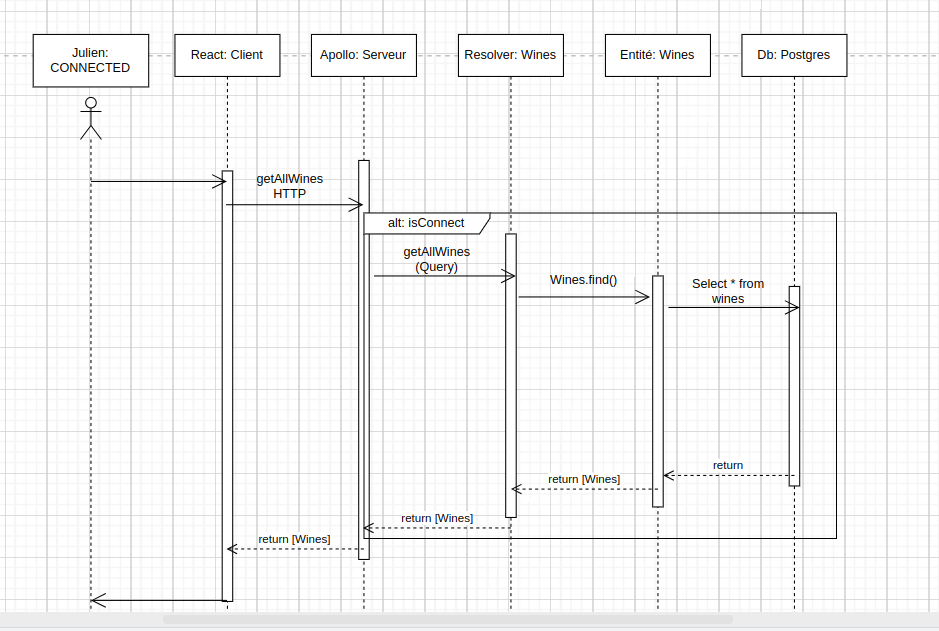

# Partie de mise en place de l'autorisation



## Pièce n°1

```typescript
export const parseCookie = (key: string): { [key: string]: string } => {
  return key.split("; ").reduce((acc, el) => {
    if (el.includes("trainer")) {
      const token = el.split("=");
      acc[token[0]] = token[1];
    }
    return acc;
  }, {});
};
```

## Pièce n°2

```typescript
import { parseCookie } from "./utils/cookie";
```

## Pièce n°3

```typescript
authChecker: ({ context }): boolean => {
  return context?.loggedInUser?.email;
},
```

## Pièce n°4

```typescript
if (!req.headers.cookie) return { res };

const cookies: { [key: string]: string } = parseCookie(req.headers.cookie);

if (!cookies.trainer_token) return { res };

try {
  const payload = jwt.verify(
    cookies.trainer_token,
    process.env.AUTH_SECRET_KEY as string
  );
  return { res, loggedInUser: payload };
} catch {
  return { res };
}
```

## Pièce n°5

```typescript
import jwt from "jsonwebtoken";
```

## Pièce n°6

```typescript
 @Authorized()
```

### Pièce n°7

```typescript
import { Authorized, Query, Resolver } from "type-graphql";
```
