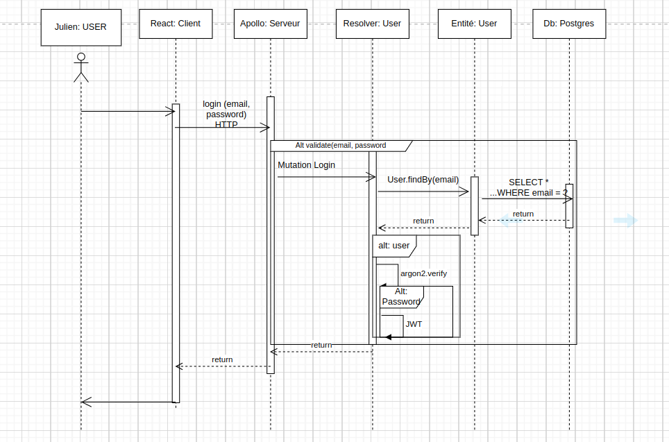

# Partie de mise en place de l'authentification



## Pièce n°1

```typescript
context: async ({ req, res }) => {
  return { res };
},
```

## Pièce n°2

```yml
gateway:
  image: nginx
  ports:
    - 7100:80
  restart: always
  volumes:
    - ./nginx/nginx.conf:/etc/nginx/nginx.conf
  depends_on:
    - client
    - api
```

## Pièce n°3

```typescript
context: async ({ req, res }) => {
  return { res };
},
```

## Pièce n°4

```typescript
const { data } = await loginMutation({
  variables: { data: { password: login.password, email: login.email } },
});

if (data && data.login) {
  handleUser(data.login);

  setTimeout(() => {
    navigate("/trainers");
  }, 1000);
  toast.success("Connexion effectuée avec succès");
} else {
  setLogin(initialLogin);
  toast.error("Identifiants incorrects");
}
```

## Pièce n°5

```typescript
const { email, password } = data;
const user = await Users.findOneByOrFail({ email });
```

## Pièce n°6

```typescript
export const LOGIN = gql`
  mutation Login($data: UserInput!) {
    login(data: $data) {
      email
      id
      isConnected
    }
  }
`;
```

## Pièce n°7

```typescript
async login(@Arg("data") data: UserInput, @Ctx() context: Context) {
```

## Pièce n°8

```typescript
const [user, setUser] = useState<User | null>({ isConnected: false });

const handleUser = (user: User): void => {
  setUser(user);
};

return (
  <AuthContext.Provider
    value={{
      user,
      handleUser,
    }}
  >
    {children}
  </AuthContext.Provider>
);
```

## Pièce n°9

```typescript
const [loginMutation] = useLoginMutation();
const navigate = useNavigate();
const { handleUser } = useAuth();
```

## Pièce n°10

```typescript
{
  path: "/login",
  element: <Login />,
},
```

## Pièce n°11

```typescript
const { AUTH_SECRET_KEY } = process.env;
```

## Pièce n°12

```typescript
const token = jwt.sign(
  {
    id: user.id,
    email: user.email,
  },
  AUTH_SECRET_KEY as string,
  {
    expiresIn: "48h",
  }
);
context.res.setHeader(
  "Set-Cookie",
  `trainer_token=${token};httpOnly;secure;SameSite=Strict;expires=${new Date(
    new Date().getTime() + 1000 * 60 * 60 * 48 // 2 days
  ).toUTCString()}`
);
```

## Pièce n°13

```typescript
if (await argon2.verify(user.hash, password)) {
  // Some Code here

  return {
    id: user.id,
    email: user.email,
    isConnected: true,
  };
}
```

## Pièce n°14

```typescript
import { useNavigate } from "react-router";
import { useLoginMutation } from "../generated/graphql-types";
import { useAuth } from "../contexts/Auth";
```

## Pièce n°15

```typescript
import "dotenv/config";
import jwt from "jsonwebtoken";
import { Context } from "..";
```

# Pièce n°16

```
events {}

http {
	include       /etc/nginx/mime.types;
	default_type  application/octet-stream;

	sendfile        on;
	keepalive_timeout 65;

	server {
		listen 80;

		root /var/www/html/public;
    index index.php index.html;

		location /api {
			proxy_pass http://api:4000;
		}

		location / {
			proxy_pass http://client:5173;
			proxy_http_version 1.1;
			proxy_set_header Connection "upgrade";
			proxy_set_header Host $host;
			proxy_set_header Upgrade $http_upgrade;
			proxy_cache_bypass $http_upgrade;
		}
	}
}
```

## Pièce n° 18

```
VITE_APOLLO_SERVER=/api
```

## Pièce n°19

```typescript
const client = new ApolloClient({
  uri: import.meta.env.VITE_APOLLO_SERVER,
  cache: new InMemoryCache(),
  credentials: "include",
});
```
